# Museum-AR
Explore Art & AR at home

---

### Techs

- [Kotlin](https://kotlinlang.org/) - Google's preferred language for Android app development.
- [Android Studio](https://developer.android.com/studio) - The official Integrated Development Environment (IDE) for Android app development.
- [Firebase Firestore](https://firebase.google.com/docs/firestore) - A flexible, scalable database for mobile, web, and server development from Firebase and Google Cloud.

### Demo
- [Demo Video](https://1drv.ms/v/s!Au2sF_i0UtKPgfsQLuY9F-C1w7ynnw?e=KRjpz9) - Our application showcase at University of Engineering and Technology.

<table>
  <tr>
    <td>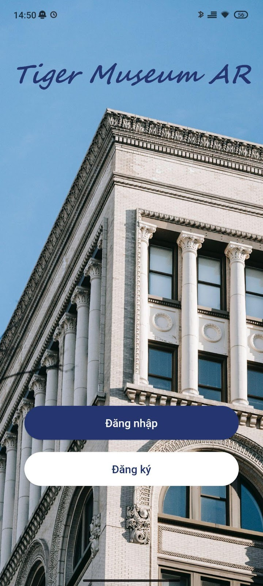</td>
    <td>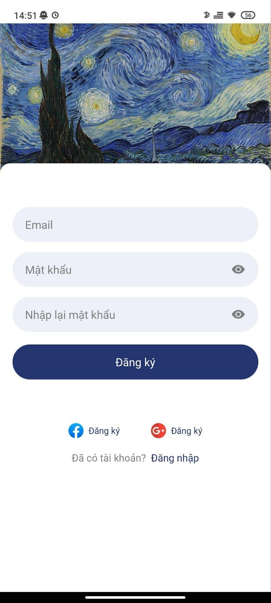</td>
    <td>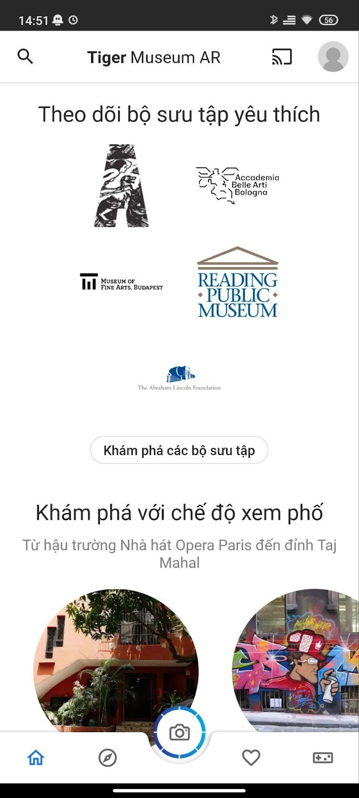</td>
    <td></td>
    <td></td>
  </tr>
  <tr>
    <td>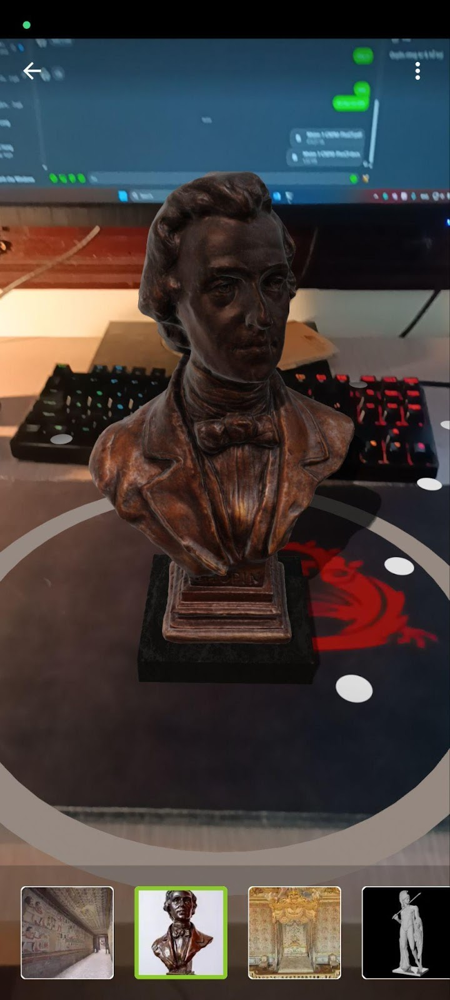</td>
    <td>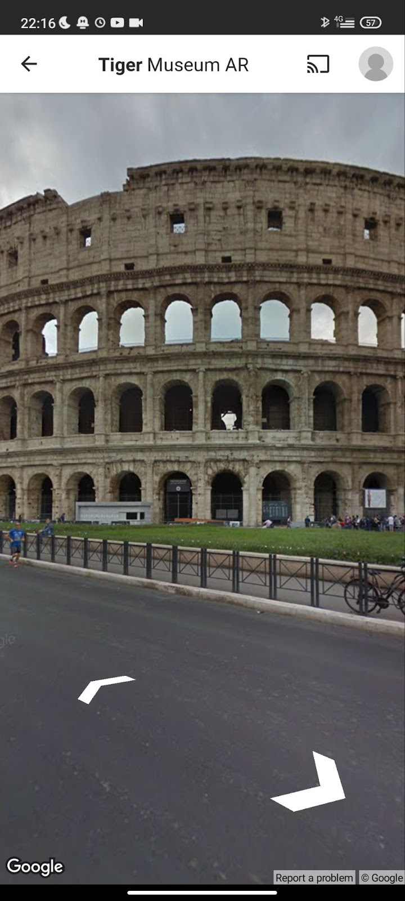</td>
    <td>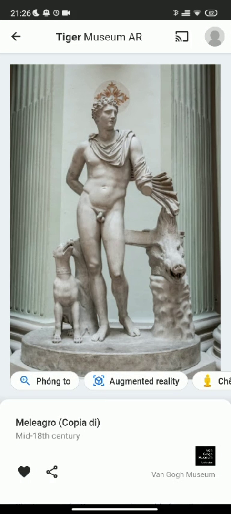</td>
    <td>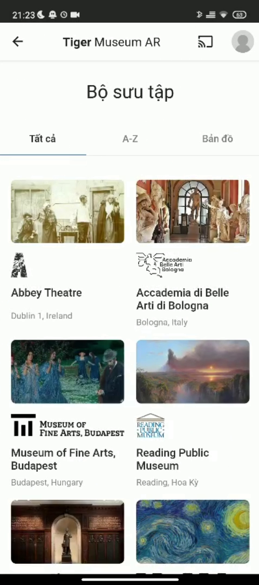</td>
    <td>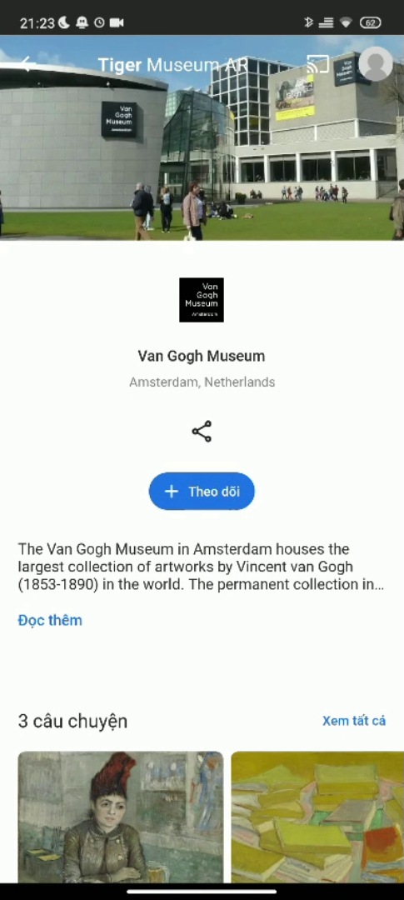</td>
  </tr>
  <tr>
    <td>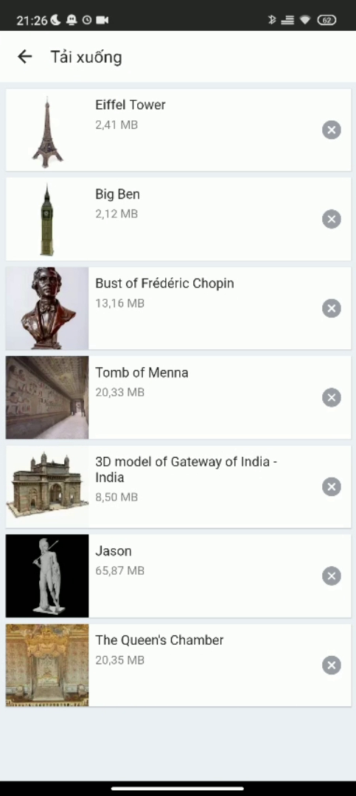</td>
    <td>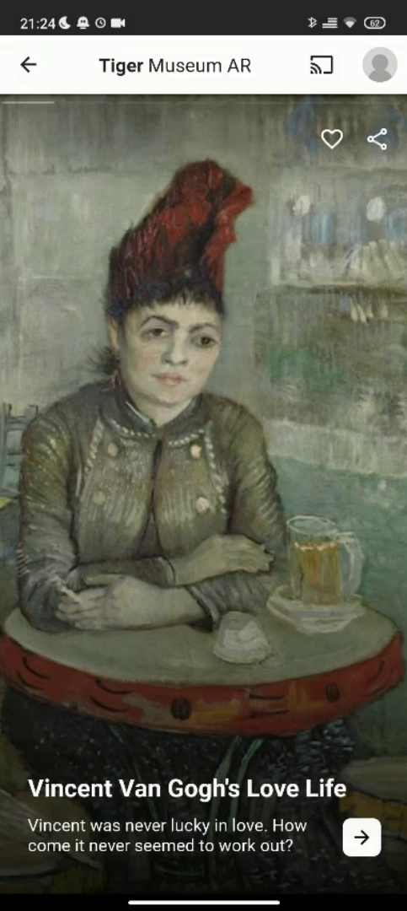</td>
    <td>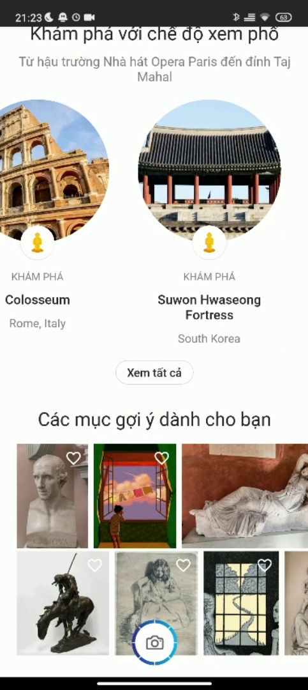</td>
    <td>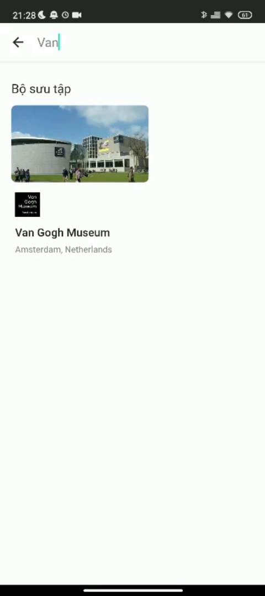</td>
    <td>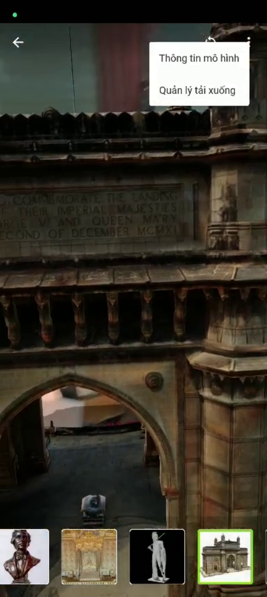</td>
  </tr>
</table>
